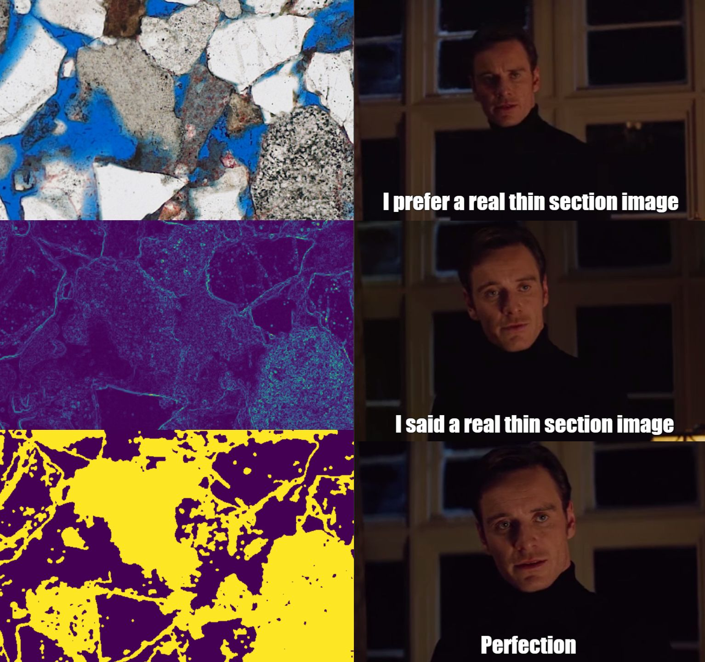

# Automated Thin Section Analysis

**Independent Research Project for MSc Applied Computational Science and Engineering**

**Richard Boyne (GitHub: Boyne272, CID: 01057503, email: rmb115@ic.ac.uk)**

**This repo holds the Thin Section Analysis (TSA) python package, a tool set designed to help build workflows to automate aspects of thin section image analysis. Full documentation and user manual (with examples) is available [here](https://msc-acse.github.io/acse-9-independent-research-project-Boyne272/index.html)**

## Repository Structure
- TSA/ is the module directory, holding the submodule code (K-means, merging, pre_post_processing, tools) and tests for all these. pip in the repo will use setup.py to install this module and pytest will run all module tests (see user manual for more detailed instructions).
- images/ holds a several sample (1000x1000) TS image sections. These were used to collect results for the final report.
- docs/ holds sphinx generated documentation in HTML format. Due to admin restrictions on this repository's settings the repo has been forked to host the documentation via GitHub pages.
- sphinx/ holds the code used to generate the documentation in docs/.
- notebooks/ holds all notebooks used to develop and run the given code (in the [Google Colab environment](https://colab.research.google.com/notebooks/welcome.ipynb#recent=true)). This includes Thin_Sections_Workspace.ipynb used to develop and experiment with code, Results.iypnb which generates all figures and values used in the report and User_manual.ipynb which is an interactive version of the user manual found on the documentation page.
- Preliminary Report Richard Boyne.pdf and Final Report Richard Boyne.pdf are the project plan and report (submitted 5th June and 30th August respectively)

## Installation
Refer to the documentation for instructions on how to install the package. Alternatively if notebooks/User_manual.ipynb is loaded into Google Colab one can use the entire package from there. One can also download the repository and open these notebooks locally, but you must then take caution with file paths in the installation and example codes.

## Notes to the Examiner
As the User_manual.ipynb is in the documentation page you can view it from there as GitHub online notebook viewer often struggles with large notebooks. If you need to run the code I recommend using the User_manual.ipynb in Google Colab as described above. Hope the repo and code are clear to follow.

For the report 12pt has been used with latex default font, the page count is 22 for the report body, plus 3 title and contense pages (meeting 25 page requirement), plus 5 biblography/appendix (so 30 in total).

As always here is an appropriate meme :p

