User Manual
===========

Instillation and usage instructions for the Thin Section Analysis (TSA)
python package.

Created by Richard Boyne (rmb115@ic.ac.uk) on 25th August 2019

Downloads
---------

The software is kept in the github repo:
https://github.com/msc-acse/acse-9-independent-research-project-Boyne272.git

It contains a setup.py for instillation and all code is kept in the TSA
directory.

The following code will clones the repo locally (checked in google
colab).

.. code:: ipython3

    from getpass import getpass
    from gettext import gettext
    import os
    
    # if we have not already in a repo
    if not os.path.isdir(".git"):
        
        # get username and password
        user = input('github username: ')
        password = getpass('github password: ')
        os.environ['GITHUB_AUTH'] = user + ':' + password
    
        # clone the repo and move into it
        !git clone --quiet https://$GITHUB_AUTH@github.com/msc-acse/acse-9-independent-research-project-Boyne272.git TSA_repo
        %cd TSA_repo
    
        # swap to the wanted branch
        !git checkout Release --quiet
    
    # show where we are
    !git show --summary

.. parsed-literal::

    github username: Boyne272
    github password: ··········
    /content/TSA_repo
    commit bc2b4667f6905c3795451de25b9d98438e3e401b (HEAD -> Release, origin/Release)
    Author: Richard Boyne <boynerichard@yahoo.co.uk>
    Date:   Tue Aug 27 14:16:50 2019 +0000
    
        moved all old code out of the TSA pack folder
        
        now it is not brought in when installing, still kept around as might be useful
    
     delete mode 100644 TSA/merging/legacy/tools.py
     rename {TSA/kmeans/legacy => notebooks/older_code}/Kmeans_Examples.ipynb (100%)
     rename {TSA/merging/legacy => notebooks/older_code}/image_filters.py (100%)
     rename {TSA/kmeans/legacy => notebooks/older_code}/kmeans_basic.py (100%)
     rename {TSA/kmeans/legacy => notebooks/older_code}/kmeans_img.py (100%)
     rename {TSA/kmeans/legacy => notebooks/older_code}/kmeans_local.py (100%)
     rename {TSA/kmeans/legacy => notebooks/older_code}/kmeans_local_failed.py (100%)
     rename {TSA/kmeans/legacy => notebooks/older_code}/kmeans_multi_fail.py (100%)
     rename {TSA/merging/legacy => notebooks/older_code}/merge_wrapper.py (100%)
     rename {TSA/merging/legacy => notebooks/older_code}/merge_wrapper_failed.py (100%)
     rename {TSA/merging/legacy => notebooks/older_code}/preprocessing.py (100%)
     rename {TSA/merging/legacy => notebooks/older_code}/recombination_wrapper.py (100%)
     rename {TSA/kmeans/legacy => notebooks/older_code}/tools.py (100%)
     rename {TSA/kmeans/legacy => notebooks/older_code}/tst_kmeans_basic.py (100%)
     rename {TSA/kmeans/legacy => notebooks/older_code}/tst_kmeans_img.py (100%)
     rename {TSA/kmeans/legacy => notebooks/older_code}/tst_kmeans_local.py (100%)
    

Installation
------------

To install the module first the requierments need be installed, this can
be done with.

.. code:: ipython3

    !pip install -r requirements.txt

.. parsed-literal::

    Requirement already satisfied: numpy==1.16.4 in /usr/local/lib/python3.6/dist-packages (from -r requirements.txt (line 1)) (1.16.4)
    Requirement already satisfied: matplotlib==3.0.3 in /usr/local/lib/python3.6/dist-packages (from -r requirements.txt (line 2)) (3.0.3)
    Requirement already satisfied: scipy==1.3.1 in /usr/local/lib/python3.6/dist-packages (from -r requirements.txt (line 3)) (1.3.1)
    Requirement already satisfied: torch==1.1.0 in /usr/local/lib/python3.6/dist-packages (from -r requirements.txt (line 4)) (1.1.0)
    Requirement already satisfied: scikit-image==0.15.0 in /usr/local/lib/python3.6/dist-packages (from -r requirements.txt (line 5)) (0.15.0)
    Requirement already satisfied: kiwisolver>=1.0.1 in /usr/local/lib/python3.6/dist-packages (from matplotlib==3.0.3->-r requirements.txt (line 2)) (1.1.0)
    Requirement already satisfied: pyparsing!=2.0.4,!=2.1.2,!=2.1.6,>=2.0.1 in /usr/local/lib/python3.6/dist-packages (from matplotlib==3.0.3->-r requirements.txt (line 2)) (2.4.2)
    Requirement already satisfied: python-dateutil>=2.1 in /usr/local/lib/python3.6/dist-packages (from matplotlib==3.0.3->-r requirements.txt (line 2)) (2.5.3)
    Requirement already satisfied: cycler>=0.10 in /usr/local/lib/python3.6/dist-packages (from matplotlib==3.0.3->-r requirements.txt (line 2)) (0.10.0)
    Requirement already satisfied: PyWavelets>=0.4.0 in /usr/local/lib/python3.6/dist-packages (from scikit-image==0.15.0->-r requirements.txt (line 5)) (1.0.3)
    Requirement already satisfied: pillow>=4.3.0 in /usr/local/lib/python3.6/dist-packages (from scikit-image==0.15.0->-r requirements.txt (line 5)) (4.3.0)
    Requirement already satisfied: networkx>=2.0 in /usr/local/lib/python3.6/dist-packages (from scikit-image==0.15.0->-r requirements.txt (line 5)) (2.3)
    Requirement already satisfied: imageio>=2.0.1 in /usr/local/lib/python3.6/dist-packages (from scikit-image==0.15.0->-r requirements.txt (line 5)) (2.4.1)
    Requirement already satisfied: setuptools in /usr/local/lib/python3.6/dist-packages (from kiwisolver>=1.0.1->matplotlib==3.0.3->-r requirements.txt (line 2)) (41.2.0)
    Requirement already satisfied: six>=1.5 in /usr/local/lib/python3.6/dist-packages (from python-dateutil>=2.1->matplotlib==3.0.3->-r requirements.txt (line 2)) (1.12.0)
    Requirement already satisfied: olefile in /usr/local/lib/python3.6/dist-packages (from pillow>=4.3.0->scikit-image==0.15.0->-r requirements.txt (line 5)) (0.46)
    Requirement already satisfied: decorator>=4.3.0 in /usr/local/lib/python3.6/dist-packages (from networkx>=2.0->scikit-image==0.15.0->-r requirements.txt (line 5)) (4.4.0)
    

Now to install the moudle use pip install in the directory where the
setup.py file is.

.. code:: ipython3

    pip install . # if currently in the repo

.. parsed-literal::

    Processing /content/TSA_repo
    Requirement already satisfied: numpy in /usr/local/lib/python3.6/dist-packages (from TSA==1.0.0) (1.16.4)
    Requirement already satisfied: matplotlib in /usr/local/lib/python3.6/dist-packages (from TSA==1.0.0) (3.0.3)
    Requirement already satisfied: scipy in /usr/local/lib/python3.6/dist-packages (from TSA==1.0.0) (1.3.1)
    Requirement already satisfied: torch in /usr/local/lib/python3.6/dist-packages (from TSA==1.0.0) (1.1.0)
    Requirement already satisfied: scikit-image in /usr/local/lib/python3.6/dist-packages (from TSA==1.0.0) (0.15.0)
    Requirement already satisfied: python-dateutil>=2.1 in /usr/local/lib/python3.6/dist-packages (from matplotlib->TSA==1.0.0) (2.5.3)
    Requirement already satisfied: kiwisolver>=1.0.1 in /usr/local/lib/python3.6/dist-packages (from matplotlib->TSA==1.0.0) (1.1.0)
    Requirement already satisfied: cycler>=0.10 in /usr/local/lib/python3.6/dist-packages (from matplotlib->TSA==1.0.0) (0.10.0)
    Requirement already satisfied: pyparsing!=2.0.4,!=2.1.2,!=2.1.6,>=2.0.1 in /usr/local/lib/python3.6/dist-packages (from matplotlib->TSA==1.0.0) (2.4.2)
    Requirement already satisfied: PyWavelets>=0.4.0 in /usr/local/lib/python3.6/dist-packages (from scikit-image->TSA==1.0.0) (1.0.3)
    Requirement already satisfied: imageio>=2.0.1 in /usr/local/lib/python3.6/dist-packages (from scikit-image->TSA==1.0.0) (2.4.1)
    Requirement already satisfied: networkx>=2.0 in /usr/local/lib/python3.6/dist-packages (from scikit-image->TSA==1.0.0) (2.3)
    Requirement already satisfied: pillow>=4.3.0 in /usr/local/lib/python3.6/dist-packages (from scikit-image->TSA==1.0.0) (4.3.0)
    Requirement already satisfied: six>=1.5 in /usr/local/lib/python3.6/dist-packages (from python-dateutil>=2.1->matplotlib->TSA==1.0.0) (1.12.0)
    Requirement already satisfied: setuptools in /usr/local/lib/python3.6/dist-packages (from kiwisolver>=1.0.1->matplotlib->TSA==1.0.0) (41.2.0)
    Requirement already satisfied: decorator>=4.3.0 in /usr/local/lib/python3.6/dist-packages (from networkx>=2.0->scikit-image->TSA==1.0.0) (4.4.0)
    Requirement already satisfied: olefile in /usr/local/lib/python3.6/dist-packages (from pillow>=4.3.0->scikit-image->TSA==1.0.0) (0.46)
    Building wheels for collected packages: TSA
      Building wheel for TSA (setup.py) ... [?25l[?25hdone
      Created wheel for TSA: filename=TSA-1.0.0-cp36-none-any.whl size=41155 sha256=2476c8a3c458cc47319eb35aba98ba8bcdd32d8c52c9f221d6d3f686c918e8ed
      Stored in directory: /tmp/pip-ephem-wheel-cache-1u2763_c/wheels/ea/a3/39/2504a755f1161b16e6d23f984250c40e18af62f819ed7d4951
    Successfully built TSA
    Installing collected packages: TSA
    Successfully installed TSA-1.0.0
    

Alternativly the direcory TSA can be place locally where it is needed
and imported just as if it had been installed

Running Test Suites
-------------------

All tests are contained in the modules directory, in the tests folder.
Pytest is able to pick up on them, alternativly any test file will work
if run by itself. Some of the tests requier the test images which are
also in in the test folder.

.. code:: ipython3

    !pytest # last run 27th Aug 2019

.. parsed-literal::

    ============================= test session starts ==============================
    platform linux2 -- Python 2.7.15+, pytest-3.6.4, py-1.8.0, pluggy-0.7.1
    rootdir: /content/TSA_repo, inifile:
    collected 24 items                                                             
    
    TSA/tests/test_AGNES.py ...                                              [ 12%]
    TSA/tests/test_Image_processor.py ....                                   [ 29%]
    TSA/tests/test_MSLIC.py ...                                              [ 41%]
    TSA/tests/test_SLIC.py .....                                             [ 62%]
    TSA/tests/test_Segment_Analyser.py .                                     [ 66%]
    TSA/tests/test_Segments.py ........                                      [100%]
    
    ========================== 24 passed in 84.44 seconds ==========================
    

Example: Butterfly Segmentation
===============================

.. code:: ipython3

    # Ipython Magic Functions
    %matplotlib inline
    
    # imports
    import matplotlib.pyplot as plt
    import numpy as np
    import pandas as pd 
    
    # TAS imports
    from TSA.pre_post_processing import Image_processor
    from TSA.pre_post_processing import Segment_Analyser
    from TSA.merging import AGNES
    from TSA.merging import segment_group
    from TSA.kmeans import SLIC
    from TSA.kmeans import MSLIC_wrapper

Image Loading
-------------

First we need to load the image, Image processor is a module to assist
with loading an image and apply any kind of filters initially wanted.

.. code:: ipython3

    butterfly_IP = Image_processor(path='images/butterfly.tif')
    butterfly_IP.plot()

.. image:: output_13_0.png

Segmentation
------------

For the SLIC segmentation it help reduce disjointed segments if we first
clur the image slightly, this quite easy to do with Image\_processor.

.. code:: ipython3

    blured_img = butterfly_IP.gauss(sigma=3)

Now we can look at what SLIC manages to do with this.

.. code:: ipython3

    # create the SLIC object iterate it and plot
    butterfly_SLIC = SLIC(blured_img, bin_grid=[25, 25])
    butterfly_SLIC.iterate(10)
    butterfly_SLIC.plot()

.. parsed-literal::

    Progress |###################################################| 85.1418 s

.. image:: output_17_1.png

Segment Clustering
------------------

To extract features of each segment for clustering we need to create a
segment\_group obj. This will need the mask from the SLUC implenetation.
When initialising disjoineted segments will be split, hence there will
be more segments than in the above image.

.. code:: ipython3

    # extract mask
    butterfly_mask = butterfly_SLIC.get_segmentation()
    
    # create segment groups, enforce size and plot
    butterfly_segs = segment_group(butterfly_mask)
    
    # plot the segments
    original_img = butterfly_IP.imgs['original']
    butterfly_segs.plot(back_img=original_img)

.. parsed-literal::

    Initalising 641 segments
    Progress |###################################################| 13.8670 s
    
    

.. image:: output_19_1.png

This splitting makes several very small segments. We can force these to
merge with there largest neighbour with segment\_group.

.. code:: ipython3

    butterfly_segs.enforce_size(min_size=50)

.. parsed-literal::

    13 segments merged
    Initalising 65 segments
    Progress |###################################################| 1.6826 s
    
    

Notice how only 65 segments were recreated; since those with unchanging
neighbours dont need any recaculations they are kept the same.

Now we can extract features from each segment, to do an extraction
function is needed.

.. code:: ipython3

    # define the features to be extracted
    def basic_color_extraction(Xs, Ys, img1):
        avgs1 = img1[Ys, Xs].mean(axis=0)
        return [*avgs1]
    
    # extract features
    butterfly_feats = butterfly_segs.feature_extraction(
                          extract_func = basic_color_extraction,
                          func_vars = [blured_img])
    
    # inspect features
    titles = ['red_avg', 'green_avg', 'blue_avg']
    pd.DataFrame(butterfly_feats, columns=titles).describe()

.. raw:: html

    

    
    <table border="1" class="dataframe">
      <thead>
        <tr style="text-align: right;">
          <th></th>
          <th>red_avg</th>
          <th>green_avg</th>
          <th>blue_avg</th>
        </tr>
      </thead>
      <tbody>
        <tr>
          <th>count</th>
          <td>628.000000</td>
          <td>628.000000</td>
          <td>628.000000</td>
        </tr>
        <tr>
          <th>mean</th>
          <td>0.633492</td>
          <td>0.590180</td>
          <td>0.548509</td>
        </tr>
        <tr>
          <th>std</th>
          <td>0.178521</td>
          <td>0.161467</td>
          <td>0.188331</td>
        </tr>
        <tr>
          <th>min</th>
          <td>0.139023</td>
          <td>0.050462</td>
          <td>0.034291</td>
        </tr>
        <tr>
          <th>25%</th>
          <td>0.495582</td>
          <td>0.529275</td>
          <td>0.465894</td>
        </tr>
        <tr>
          <th>50%</th>
          <td>0.584799</td>
          <td>0.646804</td>
          <td>0.618828</td>
        </tr>
        <tr>
          <th>75%</th>
          <td>0.780434</td>
          <td>0.693747</td>
          <td>0.668248</td>
        </tr>
        <tr>
          <th>max</th>
          <td>0.986018</td>
          <td>0.911795</td>
          <td>0.935627</td>
        </tr>
      </tbody>
    </table>
    

We have used a pandas dataframe to inspect the extracted features. They
seem good, with means and standard deviations of similar magnitude. We
can now use our chosen unspuervised clustering algorithm to group
segments by common features. Here we are using the AGNES clustering

.. code:: ipython3

    butterly_AGNES = AGNES(butterfly_feats)
    butterly_AGNES.iterate()
    butterly_AGNES.cluster_distance_plot('all')

.. parsed-literal::

    Progress |###################################################| 0.3728 s
    
    

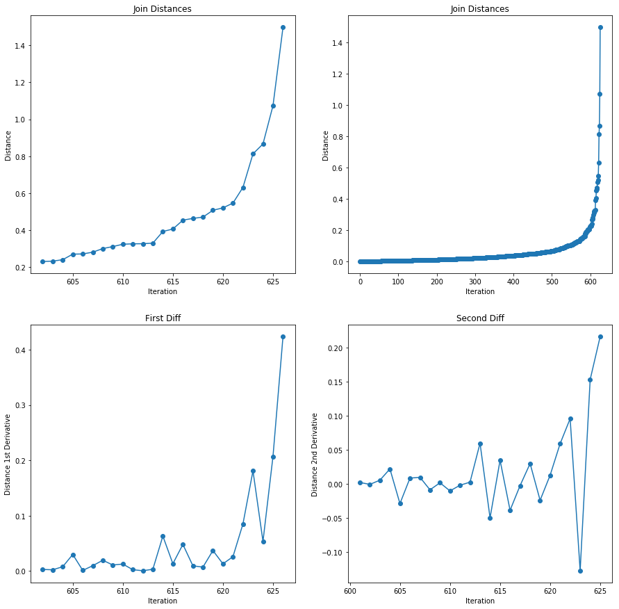

Plotted above is merge distance vs iterations and its respective
derivatives on the last few iterations. In the second derivative there
is a spike arounf iteration 610, suggesting that this is where we start
merging different material groups. To get this point we cluster up to a
certain viaration in standard deviation, here chosen to be 3.

.. code:: ipython3

    # get the clustering up to 3rd standard deviation
    butterly_clusters = butterly_AGNES.cluster_by_derivative(n_std=3., plot=False)

.. parsed-literal::

    Clustering up to 2nd derivative 0.04021483184552015  distance  0.3929593875662745
    Clustering into 14 segments
    

By passing this clustering to the segment\_group we can plot what
segments were cluster together.

.. code:: ipython3

    # assign these cluster in the segment groups
    butterfly_segs.assign_clusters(butterly_clusters)
    
    # plot these clusters
    butterfly_segs.plot('cluster_all', back_img = original_img)

.. image:: output_29_0.png

Though only color was used the clusters are mostly reasonable, thoough a
few regions of wing are confused with sky. If we are happy with these
clusters we can merge with them, if not we can do another featuer
extraction and clustering without needing to reinitalise the
segment\_group object.

Edge analysis
-------------

If we want to an edge detection can be done to assist the later merging
so that only segments with no edge between them are merged. This is not
needed to do the mergering, so this section can be skipped.

First we need an image with edges detected in it.

.. code:: ipython3

    butterfly_IP.reset()
    butterfly_IP.scharr()
    grey_img = butterfly_IP.grey_scale()
    binary_edges = butterfly_IP.threshold(value=.05)
    butterfly_IP.plot()

.. image:: output_32_0.png

Now by defining an edge confidence function with this image (similar to
the feature extraction function before) we can assign this to the
segment\_group object.

.. code:: ipython3

    # define extraction function
    def edge_extraction(Xs, Ys, scharr_img):
        return scharr_img[Ys, Xs].mean() / scharr_img.std()
    
    # pass this to the group object and plot it
    butterfly_segs.edge_confidence(confidence_func = edge_extraction,
                                   func_vars = [binary_edges])
    butterfly_segs.plot('edge_conf', back_img = original_img)

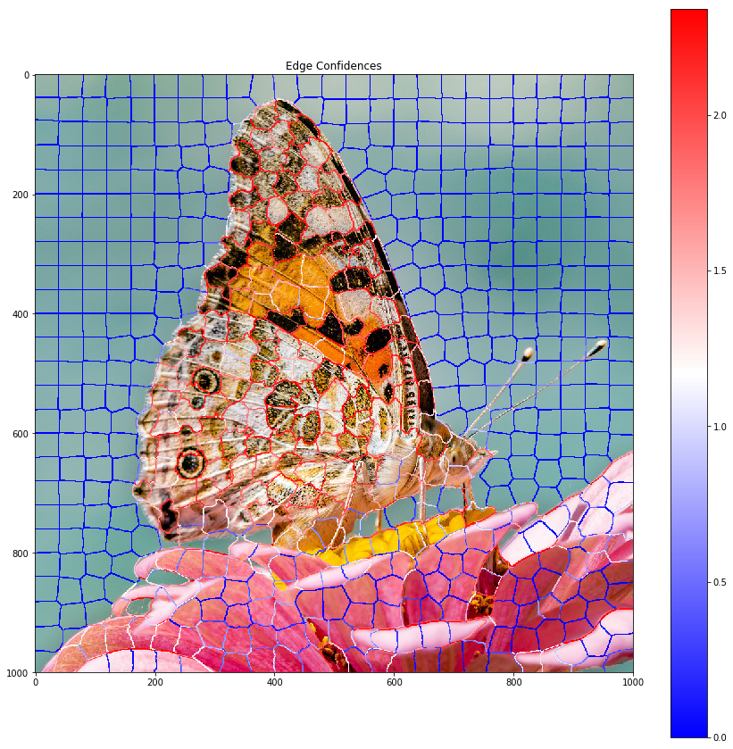

So as we can see some edges are confident that they exist and others are
less so. Since these have been assigned to the segment\_group they will
automatically be considered in the merging stage (the threshold for an
edge being present can be set if want)

Segment Merging
---------------

Now the segment\_group knows the clustering (and edge confidences) we
can instruct it to merge segments that are adjasent, in the same cluster
(and have a edge confidence below the given threshold). Note we could
also merge without clusters and just edge confidence instead.

.. code:: ipython3

    # merge using clustering and edge confidence (if given)
    butterfly_segs.merge_by_cluster(edge_present=1.)
    
    # # merge if there is a low edge confidence only
    # butterfly_segs.merge_by_edge(edge_absent=.1) 
    
    # plot the resultant clustering
    butterfly_segs.plot('merged_edges', back_img=butterfly_IP.imgs['original'])

.. parsed-literal::

    412 segments merged
    Initalising 113 segments
    Progress |###################################################| 3.0159 s
    
    

.. image:: output_37_1.png

Repeat
------

At this point the process of clustering, edge detection and merging
could be repeated if wanted.

Caution is needed when clustering as there are less samples in the
clustering routene so it may struggle. Another point of caution is that
if one experiments with different clustering here it will affect the
clusters used in the segment analysis section.

This second repeat is done here as it is not benificial for this image.

Segmentation Analysis
---------------------

Now we have our segmented image we can analyse the distributions within
each cluster.

First we need to create the Segment\_Analysis obj with the segmentation
mask and clustering mask.

.. code:: ipython3

    # extract the cluster mask
    butterfly_cluster = butterfly_segs.get_cluster_mask()
    
    # extract the segments mask
    butterfly_mask = butterfly_segs.mask
    
    # create the segment analyser obj
    butterfly_SA = Segment_Analyser(img = original_img,
                                    mask = butterfly_mask,
                                    clusters=butterfly_cluster)

We can then label each cluster as something more appropirate for the
analysis. If we think two clusters are actually part of the same
material we give them both the same label and the clusters are grouped.
Here we will just label with sky, wing or flower for simplicity. Note
that even within this relativly coarse labelling there are still regions
of conflict where segments of say wing and sky are clustered together.

.. code:: ipython3

    butterfly_SA.set_labels()

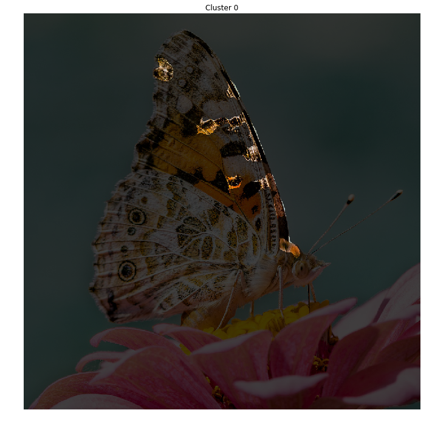

.. parsed-literal::

    Currently labelled  0 
    Give a new label (leave blank to unchange):
    wing
    

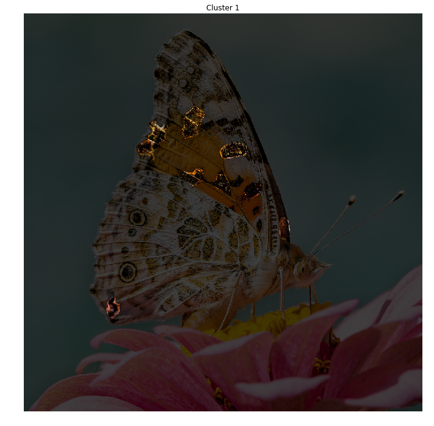

.. parsed-literal::

    Currently labelled  1 
    Give a new label (leave blank to unchange):
    wing
    

.. image:: output_42_4.png

.. parsed-literal::

    Currently labelled  2 
    Give a new label (leave blank to unchange):
    wing
    

.. image:: output_42_6.png

.. parsed-literal::

    Currently labelled  3 
    Give a new label (leave blank to unchange):
    wing
    

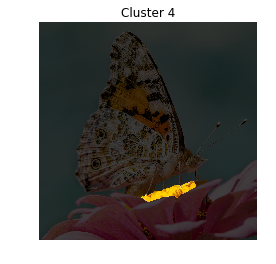

.. parsed-literal::

    Currently labelled  4 
    Give a new label (leave blank to unchange):
    flower core
    

.. image:: output_42_10.png

.. parsed-literal::

    Currently labelled  5 
    Give a new label (leave blank to unchange):
    sky
    

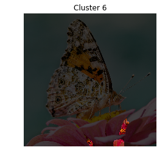

.. parsed-literal::

    Currently labelled  6 
    Give a new label (leave blank to unchange):
    flower petal
    

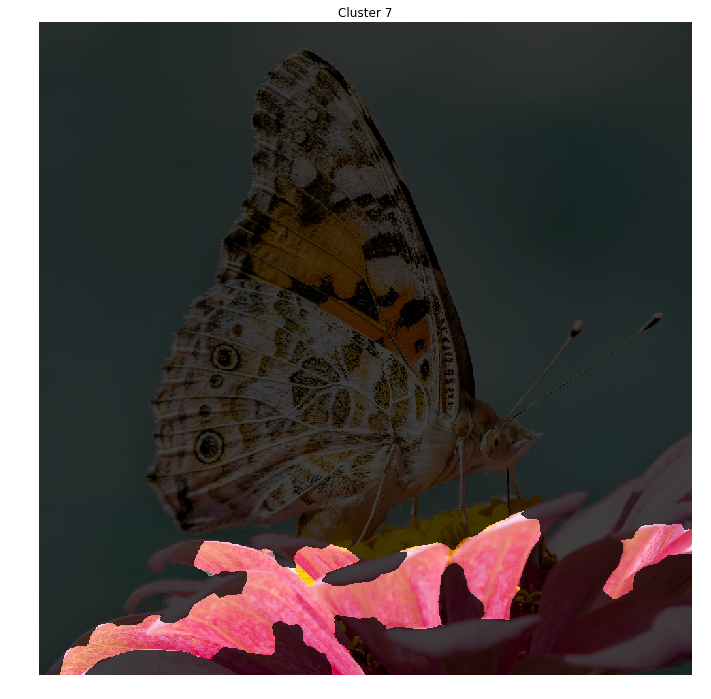

.. parsed-literal::

    Currently labelled  7 
    Give a new label (leave blank to unchange):
    flower petal
    

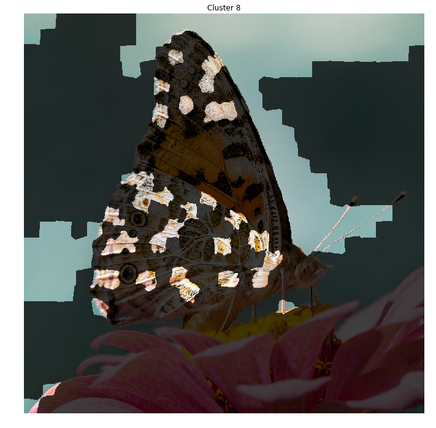

.. parsed-literal::

    Currently labelled  8 
    Give a new label (leave blank to unchange):
    sky
    

.. image:: output_42_18.png

.. parsed-literal::

    Currently labelled  9 
    Give a new label (leave blank to unchange):
    wing
    

.. image:: output_42_20.png

.. parsed-literal::

    Currently labelled  10 
    Give a new label (leave blank to unchange):
    flower petal
    

.. image:: output_42_22.png

.. parsed-literal::

    Currently labelled  11 
    Give a new label (leave blank to unchange):
    flower petal
    

.. image:: output_42_24.png

.. parsed-literal::

    Currently labelled  12 
    Give a new label (leave blank to unchange):
    flower petal
    

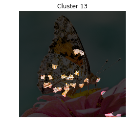

.. parsed-literal::

    Currently labelled  13 
    Give a new label (leave blank to unchange):
    wing
    Current Labels: ['wing', 'flower core', 'sky', 'flower petal']
    

Since the clusters are now labeled we can look at the overall (final)
segmentation.

.. code:: ipython3

    butterfly_SA.plot_clusters()

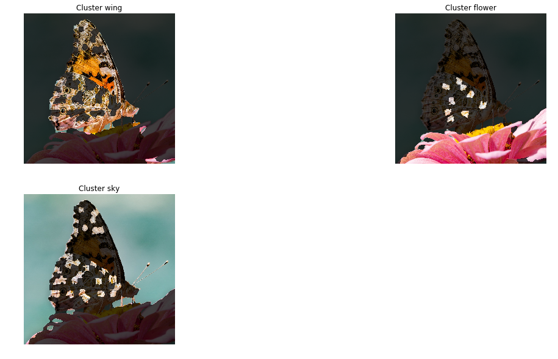

As can be seen there is some confusion between bits of wing and the
other two regions, other than that the segementation seems ok.

We can see the distributions of each cluster as well.

.. code:: ipython3

    butterfly_SA.get_composition()
    butterfly_SA.get_grain_count()

.. parsed-literal::

    Tabel of Compositions
    20.56 %	 wing
    0.95 %	 flower core
    57.57 %	 sky
    20.92 %	 flower petal
    Tabel of Grain Count
    130 	 wing
    2 	 flower core
    44 	 sky
    40 	 flower petal
    

.. image:: output_46_1.png

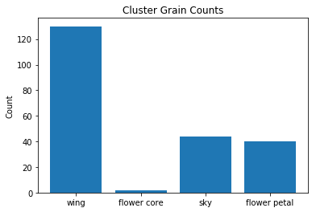

.. code:: ipython3

    # these take slighly longer to find
    for label in ['sky', 'wing', 'flower core', 'flower petal']:
        butterfly_SA.get_gsd(label)

.. parsed-literal::

    Progress |###################################################| 2.9440 scalculating span
    
    Progress |###################################################| 8.7556 scalculating span
    
    Progress |###################################################| 0.0686 scalculating span
    
    Progress |###################################################| 2.7868 scalculating span
    
    Progress |###################################################| 3.0739 s

.. image:: output_47_1.png

.. image:: output_47_2.png

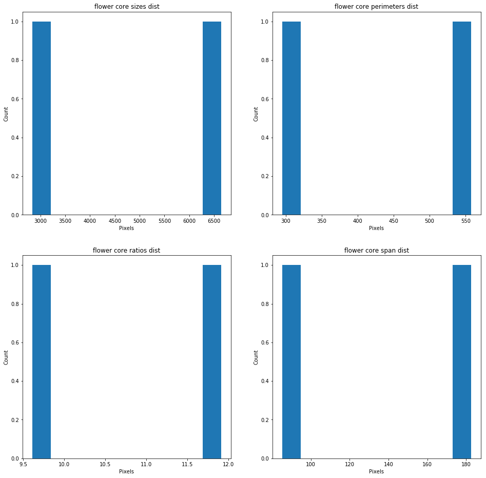

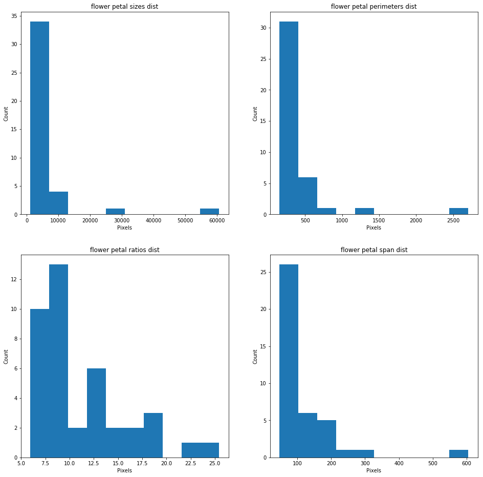

If any of the results want to be further analysed than an option
return\_arr in the above functions get the specific values plotted
above.

To save results all that needed is to save the segmentation mask and
cluster mask. These can likewise be used to pick up from any point in
the routene shown here.
