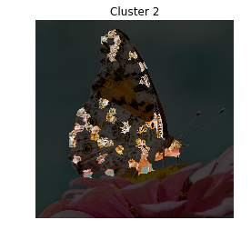
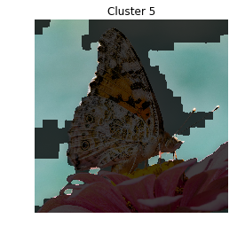
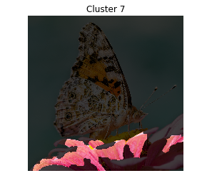
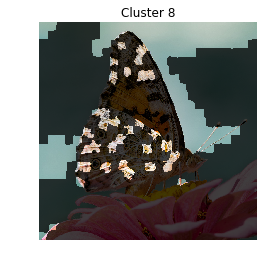
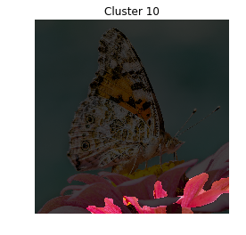
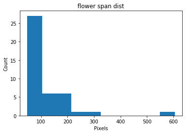

User Manual
===========

This is an example of using the tools developed for the Thin Section
Analysis project in the intended workflow.

Download Code
-------------

If not already present this clones the repo into google colab. If all
packages are already locally present this is not needed.

.. code:: ipython3

    from getpass import getpass
    import os
    
    !git config --global user.name "Richard Boyne"
    !git config --global user.email "boynerichard@yahoo.co.uk"
    
    # if not in a repo clone the desired one
    if not os.path.isdir(".git"):
        
        # get username and password
        user = "Boyne272"
        password = getpass('github password')
        os.environ['GITHUB_AUTH'] = user + ':' + password
        
        # clone the repo
        !git clone --quiet https://$GITHUB_AUTH@github.com/msc-acse/acse-9-independent-research-project-Boyne272.git repo
    
        # move the repo directory up one
        !mv repo/.git .
        
        # swap to the wanted branch
    #     !git checkout master --quiet
        !git checkout post_processing --quiet
    
        
        # move to previous commit
        !git reset --quiet --hard
        
    # remove the sample data if there
    if os.path.isdir("sample_data"):
        !rm -r sample_data/
    
    # remove the tmp repo folder if there
    if os.path.isdir("repo"):    
        !rm -r repo
        
    # show where we are
    !git show --summary

.. parsed-literal::

    github password··········
    commit 6f881be97474c6e86b1753964a084391b8edf009 (HEAD -> master, origin/master, origin/HEAD)
    Merge: 59dda18 6b8847d
    Author: Richard Boyne <31725818+Boyne272@users.noreply.github.com>
    Date:   Wed Aug 21 10:21:43 2019 +0100
    
        Merge pull request #5 from msc-acse/post_processing
        
        Post processing
    
    

Run Tests
---------

Short example of running all module tests

.. code:: ipython3

    !pytest # last run 21st Aug

.. parsed-literal::

    ============================= test session starts ==============================
    platform linux2 -- Python 2.7.15+, pytest-3.6.4, py-1.8.0, pluggy-0.7.1
    rootdir: /content, inifile:
    collected 24 items                                                             
    
    kmeans/test_MSLIC.py ...                                                 [ 12%]
    kmeans/test_SLIC.py .....                                                [ 33%]
    merging/test_AGNES.py ...                                                [ 45%]
    merging/test_Segments.py ........                                        [ 79%]
    pre_post_processing/test_Image_processor.py ....                         [ 95%]
    pre_post_processing/test_Segment_Analyser.py .                           [100%]
    
    ========================== 24 passed in 81.07 seconds ==========================
    

Imports
-------

.. code:: ipython3

    # Ipython magic functions
    %load_ext autoreload
    %autoreload 2
    %matplotlib inline
    
    # path extensions to find local modules
    import sys
    sys.path.insert(0, "/content/kmeans")
    sys.path.insert(0, "/content/merging")
    sys.path.insert(0, "/content/pre_post_processing")

.. code:: ipython3

    # imports
    import torch
    import matplotlib.pyplot as plt
    import numpy as np
    import pandas as pd 
    
    # custom imports
    from AGNES import AGNES
    from Image_processor import Image_processor
    from Segment_Analyser import Segment_Analyser
    from Segments import segment_group
    from SLIC import SLIC
    from MSLIC import MSLIC_wrapper

Butterfly Segmentation Example
==============================

First we need to load the image, Image processor is a module to assist
with loading an image and apply any kind of filters initially wanted.

.. code:: ipython3

    butterfly_IP = Image_processor(path='/content/images/butterfly.tif')
    butterfly_IP.plot()

.. image:: output_10_0.png

Segmentation
------------

For the SLIC segmentation it help reduce disjointed segments if we first
clur the image slightly, this quite easy to do with Image\_processor.

.. code:: ipython3

    blured_img = butterfly_IP.gauss(sigma=3)

Now we can look at what SLIC manages to do with this.

.. code:: ipython3

    # create the SLIC object iterate it and plot
    butterfly_SLIC = SLIC(blured_img, bin_grid=[25, 25])
    butterfly_SLIC.iterate(10)
    butterfly_SLIC.plot()

.. parsed-literal::

    Progress |###################################################| 84.5368 s

.. image:: output_14_1.png

Segment Clustering
------------------

To extract features of each segment for clustering we need to create a
segment\_group obj. This will need the mask from the SLUC implenetation.
When initialising disjoineted segments will be split, hence there will
be more segments than in the above image.

.. code:: ipython3

    # extract mask
    butterfly_mask = butterfly_SLIC.get_segmentation()
    
    # create segment groups, enforce size and plot
    butterfly_segs = segment_group(butterfly_mask)
    
    # plot the segments
    original_img = butterfly_IP.imgs['original']
    butterfly_segs.plot(back_img=original_img)

.. parsed-literal::

    641
    Initalising 641 segments
    Progress |###################################################| 53.6985 s
    
    

.. image:: output_16_1.png

This splitting makes several very small segments. We can force these to
merge with there largest neighbour with segment\_group.

.. code:: ipython3

    butterfly_segs.enforce_size(min_size=50)

.. parsed-literal::

    13 segments merged
    Initalising 65 segments
    Progress |###################################################| 5.6965 s
    
    

Notice how only 65 segments were recreated; since those with unchanging
neighbours dont need any recaculations they are kept the same.

Now we can extract features from each segment, to do an extraction
function is needed.

.. code:: ipython3

    # define the features to be extracted
    def basic_color_extraction(Xs, Ys, img1):
        avgs1 = img1[Ys, Xs].mean(axis=0)
        return [*avgs1]
    
    # extract features
    butterfly_feats = butterfly_segs.feature_extraction(
                          extract_func = basic_color_extraction,
                          func_vars = [blured_img])
    
    # inspect features
    titles = ['red_avg', 'green_avg', 'blue_avg']
    pd.DataFrame(butterfly_feats, columns=titles).describe()

.. raw:: html

    

    
    <table border="1" class="dataframe">
      <thead>
        <tr style="text-align: right;">
          <th></th>
          <th>red_avg</th>
          <th>green_avg</th>
          <th>blue_avg</th>
        </tr>
      </thead>
      <tbody>
        <tr>
          <th>count</th>
          <td>628.000000</td>
          <td>628.000000</td>
          <td>628.000000</td>
        </tr>
        <tr>
          <th>mean</th>
          <td>0.633492</td>
          <td>0.590180</td>
          <td>0.548509</td>
        </tr>
        <tr>
          <th>std</th>
          <td>0.178521</td>
          <td>0.161467</td>
          <td>0.188331</td>
        </tr>
        <tr>
          <th>min</th>
          <td>0.139023</td>
          <td>0.050462</td>
          <td>0.034291</td>
        </tr>
        <tr>
          <th>25%</th>
          <td>0.495582</td>
          <td>0.529275</td>
          <td>0.465894</td>
        </tr>
        <tr>
          <th>50%</th>
          <td>0.584799</td>
          <td>0.646804</td>
          <td>0.618828</td>
        </tr>
        <tr>
          <th>75%</th>
          <td>0.780434</td>
          <td>0.693747</td>
          <td>0.668248</td>
        </tr>
        <tr>
          <th>max</th>
          <td>0.986018</td>
          <td>0.911795</td>
          <td>0.935627</td>
        </tr>
      </tbody>
    </table>
    

We have used a pandas dataframe to inspect the extracted features. They
seem good, with means and standard deviations of similar magnitude. We
can now use our chosen unspuervised clustering algorithm to group
segments by common features. Here we are using the AGNES clustering

.. code:: ipython3

    butterly_AGNES = AGNES(butterfly_feats)
    butterly_AGNES.iterate()
    butterly_AGNES.cluster_distance_plot('all')

.. parsed-literal::

    Progress |###################################################| 0.3791 s
    
    

.. image:: output_22_1.png

Plotted above is merge distance vs iterations and its respective
derivatives on the last few iterations. In the second derivative there
is a spike arounf iteration 610, suggesting that this is where we start
merging different material groups. To get this point we cluster up to a
certain viaration in standard deviation, here chosen to be 3.

.. code:: ipython3

    # get the clustering up to 3rd standard deviation
    butterly_clusters = butterly_AGNES.cluster_by_derivative(n_std=3., plot=False)

.. parsed-literal::

    Clustering up to 2nd derivative 0.04021483184552015
    Clustering into 14 segments
    

By passing this clustering to the segment\_group we can plot what
segments were cluster together.

.. code:: ipython3

    # assign these cluster in the segment groups
    butterfly_segs.assign_clusters(butterly_clusters)
    
    # plot these clusters
    butterfly_segs.plot('cluster_all', back_img = original_img)

.. image:: output_26_0.png

Though only color was used the clusters are mostly reasonable, thoough a
few regions of wing are confused with sky. If we are happy with these
clusters we can merge with them, if not we can do another featuer
extraction and clustering without needing to reinitalise the
segment\_group object.

Edge analysis (if wanted)
-------------------------

If we want to an edge detection can be done to assist the later merging
so that only segments with no edge between them are merged. This is not
needed to do the mergering, and so this section can be skipped.

First we need an image with edges detected in it.

.. code:: ipython3

    butterfly_IP.reset()
    butterfly_IP.scharr()
    butterfly_IP.grey_scale()
    binary_edges = butterfly_IP.threshold(value=.05)
    butterfly_IP.plot()

.. image:: output_29_0.png

Now by defining an edge confidence function with this image (similar to
the feature extraction function before) we can assign this to the
segment\_group object.

.. code:: ipython3

    # define extraction function
    def edge_extraction(Xs, Ys, scharr_img):
        return scharr_img[Ys, Xs].mean() / scharr_img.std()
    
    # pass this to the group object and plot it
    butterfly_segs.edge_confidence(confidence_func = edge_extraction,
                                   func_vars = [binary_edges])
    butterfly_segs.plot('edge_conf', back_img = original_img)

.. image:: output_31_0.png

So as we can see some edges are confident that they exist and others are
less so. Since these have been assigned to the segment\_group they will
automatically be considered in the merging stage (the threshold for an
edge being present can be set if want)

Segment Merging
---------------

Now the segment\_group knows the clustering (and edge confidences) we
can instruct it to merge segments that are adjasent, in the same cluster
(and have a edge confidence below the given threshold). Note we could
also merge without clusters and just edge confidence instead.

.. code:: ipython3

    # merge using clustering and edge confidence (if given)
    butterfly_segs.merge_by_cluster(edge_present=1.)
    
    # # merge if there is a low edge confidence only
    # butterfly_segs.merge_by_edge(edge_absent=.1) 
    
    # plot the resultant clustering
    butterfly_segs.plot('merged_edges', back_img=butterfly_IP.imgs['original'])

.. parsed-literal::

    412 segments merged
    Initalising 113 segments
    Progress |###################################################| 9.8255 s
    
    

.. image:: output_34_1.png

Repeat (if wanted)
------------------

At this point the process of clustering, edge detection and merging
could be repeated if wanted.

Caution is needed when clustering as there are less samples in the
clustering routene so it may struggle. Another point of caution is that
if one experiments with different clustering here it will affect the
clusters used in the segment analysis section.

This second repeat is done here as it is not benificial for this image.

.. code:: ipython3

    # # feature extraction
    # butterfly_feats = butterfly_segs.feature_extraction(
    #                       extract_func = basic_color_extraction,
    #                       func_vars = [blured_img])
    
    # # clustering
    # butterly_AGNES = AGNES(butterfly_feats)
    # butterly_AGNES.iterate()
    
    # # get the clustering and assign it
    # butterly_clusters = butterly_AGNES.cluster_by_derivative(n_std=2., plot=False)
    # butterfly_segs.assign_clusters(butterly_clusters)
    
    # # plot these clusters
    # butterfly_segs.plot('cluster_all', back_img=original_img)

.. code:: ipython3

    # # implement cluster merging (no edge detection used this time)
    # butterfly_segs.merge_by_cluster()
    # butterfly_segs.plot('both', back_img=original_img)

Segmentation Analysis
---------------------

Now we have our segmented image we can analyse the distributions within
each cluster.

First we need to create the Segment\_Analysis obj with the segmentation
mask and clustering mask.

.. code:: ipython3

    # extract the cluster mask
    butterfly_cluster = butterfly_segs.get_cluster_mask()
    
    # extract the segments mask
    butterfly_mask = butterfly_segs.mask
    
    # create the segment analyser obj
    butterfly_SA = Segment_Analyser(img = original_img,
                                    mask = butterfly_mask,
                                    clusters=butterfly_cluster)

We can then label each cluster as something more appropirate for the
analysis. If we think two clusters are actually part of the same
material we give them both the same label and the clusters are grouped.
Here we will just label with sky, wing or flower for simplicity.

.. code:: ipython3

    butterfly_SA.set_labels()

.. image:: output_41_0.png

.. parsed-literal::

    Currently labelled  0 
    Give a new label (leave blank to unchange):
    wing
    

.. image:: output_41_2.png

.. parsed-literal::

    Currently labelled  1 
    Give a new label (leave blank to unchange):
    wing
    

.. parsed-literal::

    Currently labelled  2 
    Give a new label (leave blank to unchange):
    wing
    

.. image:: output_41_6.png

.. parsed-literal::

    Currently labelled  3 
    Give a new label (leave blank to unchange):
    wing
    

.. image:: output_41_8.png

.. parsed-literal::

    Currently labelled  4 
    Give a new label (leave blank to unchange):
    flower
    

.. parsed-literal::

    Currently labelled  5 
    Give a new label (leave blank to unchange):
    sky
    

.. image:: output_41_12.png

.. parsed-literal::

    Currently labelled  6 
    Give a new label (leave blank to unchange):
    flower
    

.. parsed-literal::

    Currently labelled  7 
    Give a new label (leave blank to unchange):
    flower
    

.. parsed-literal::

    Currently labelled  8 
    Give a new label (leave blank to unchange):
    sky
    

.. image:: output_41_18.png

.. parsed-literal::

    Currently labelled  9 
    Give a new label (leave blank to unchange):
    wing
    

.. parsed-literal::

    Currently labelled  10 
    Give a new label (leave blank to unchange):
    flower
    

.. image:: output_41_22.png

.. parsed-literal::

    Currently labelled  11 
    Give a new label (leave blank to unchange):
    flower
    

.. image:: output_41_24.png

.. parsed-literal::

    Currently labelled  12 
    Give a new label (leave blank to unchange):
    flower
    

.. image:: output_41_26.png

.. parsed-literal::

    Currently labelled  13 
    Give a new label (leave blank to unchange):
    wing
    Current Labels: ['wing', 'flower', 'sky']
    

Since the clusters are now labeled we can look at the overall (final)
segmentation.

Note the following plot function chooses colors randomly so you might
need to run a few times to get a clear image.

.. code:: ipython3

    butterfly_SA.plot_clusters()

.. image:: output_43_0.png

As can be seen there is some confusion between bits of wing and the
other two regions, other than that the segementation seems ok.

We can see the distributions of each cluster as well.

.. code:: ipython3

    butterfly_SA.get_composition()
    butterfly_SA.get_grain_count()

.. parsed-literal::

    Tabel of Compositions
    20.56 %	 wing
    21.87 %	 flower
    57.57 %	 sky
    Tabel of Grain Count
    130 	 wing
    42 	 flower
    44 	 sky
    

.. image:: output_45_1.png

.. image:: output_45_2.png

.. code:: ipython3

    # these take slighly longer to find
    for label in ['sky', 'wing', 'flower']:
        butterfly_SA.get_gsd(label)
        butterfly_SA.get_span(label)

.. parsed-literal::

    Progress |###################################################| 3.2276 s

.. image:: output_46_1.png

.. image:: output_46_2.png

.. image:: output_46_3.png

.. image:: output_46_4.png

.. image:: output_46_5.png

If any of the results want to be further analysed than an option
return\_arr in the above functions get the specific values plotted
above.

To save results all that needed is to save the segmentation mask and
cluster mask. These can likewise be used to pick up from any point in
the routene shown here.

For further information refer to the docstrings at \_\_\_\_\_\_\_\_\_.

\_ created by Richard Boyne (rmb115@ic.ac.uk) on 29th August 2019
=================================================================
